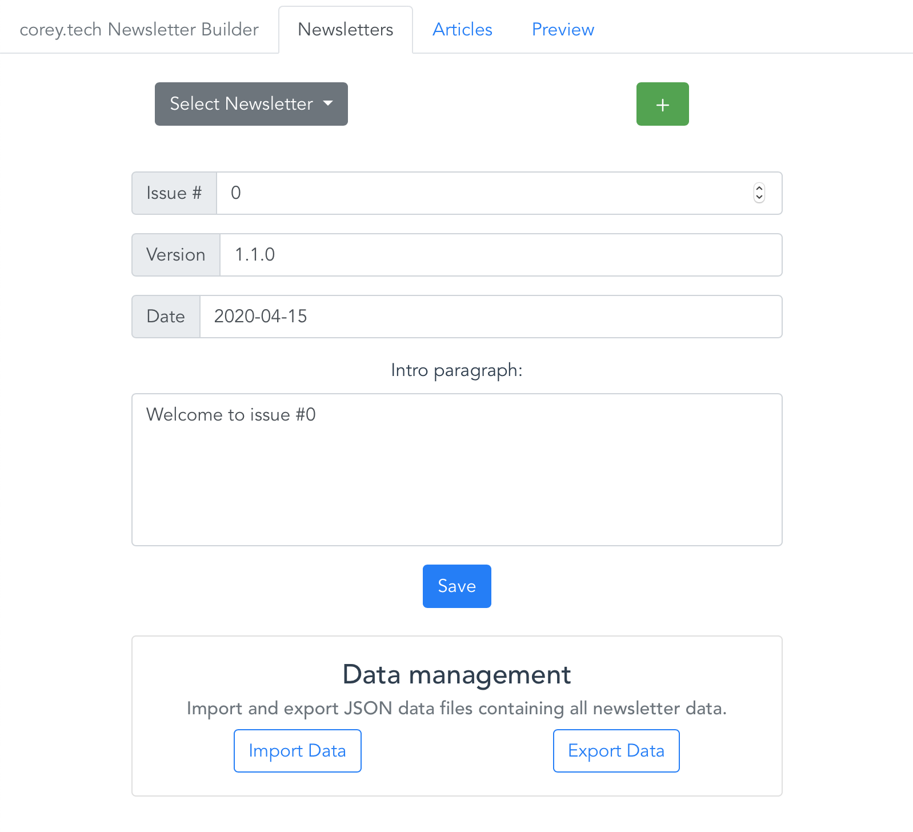

# newsletter-builder

By Corey Gale (`mechtrondev[at]gmail.com`)

## Executive summary

App I created to make writing my newsletter ([corey.tech DevOps Industry Updates](https://corey.tech)) less repetitive.

## Production environment

[corey.tech Newsletter Builder](https://nb.k8s.sandbox.ggops.com)

## Features

1. Wizard to add and edit newsletter articles
1. Generation and preview of newsletter markdown
1. API with endpoint for optimizing and zipping article images
1. One-click newsletter data import/export

## Screenshot

## Dev environment

Start:

    TINIFY_API_KEY=<your_key_here> docker-compose up -d 

Recreate:

    TINIFY_API_KEY=<your_key_here> docker-compose up -d --build --force-recreate
